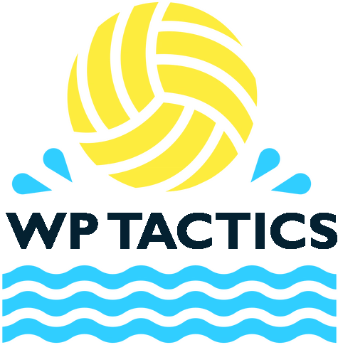

# WP Tactics

 <picture>
  <source media="(prefers-color-scheme: dark)" srcset="assets/ballMenu.png" width="200">
  <source media="(prefers-color-scheme: light)" srcset="assets/ballMenu2.png" width="200">
  
 </picture>

#### Video Demo:  <URL HERE>

### Description:

WP Tactics is a web application designed to help users understand various water polo tactics through visual and descriptive guides. The app presents a series of 2D, top-down view animations that depict different water polo situations, with each situation accompanied by detailed descriptions. The animations are created using Blender, and the app leverages modern web technologies to deliver an interactive and educational experience.

### Table of Contents

- [Features](#features)
- [Project Structure](#project-structure)
- [Installation](#installation)
- [Usage](#usage)
- [Future Improvements](#future-improvements)

### Features

- **Interactive Animations**: The app showcases various water polo tactics through 2D animations.
- **Dynamic Content**: Users can switch between different tactics, with the corresponding video, title, and description updated dynamically without needing to reload the page.
- **Responsive Design**: The layout adjusts based on the device's orientation and screen size, ensuring a smooth user experience across different platforms.
- **Links for real life examples**: Each tactic is linked to a real-life water polo game situation, providing a deeper understanding by showing how the tactic is executed in a professional match.
- **Navbar Navigation**: Both HTML pages include a navbar for easy navigation, allowing users to switch between different sections of the app seamlessly.

### Project Structure

The project consists of the following key files:

- **index.html**: This is the main entry point of the app, acting as a menu where users can select the type of tactics they want to explore.
- **animation.html**: The page where the selected tactics are displayed. It includes the video player and the dynamically updated title, description and link to real-life example.
- **index.js**: Handles the logic for loading different tactics based on user selection from the main menu.
- **script.js**: Contains the configuration and logic for updating the video player, title, and description based on user interaction within `animation.html`.
- **animate.css**: Custom CSS to style the `animation.html` page, ensuring that the content is well-organized and responsive to different screen sizes.
- **styles.css**: Styles both the `index.html` and `animation.html` page, providing a clean and intuitive user interface.
- **assets/**: A directory containing all the video (`.mp4`) and image (`.png`) files used in the project.

### Instalation:

To run WP Tactics locally, follow these steps:

    Clone the Repository:

        git clone https://github.com/slavkocalic/slavkocalic.io.git
        cd slavkocalic.io

    Open in Browser:
        Simply open index.html in your preferred web browser to start using the app.

No additional installations or dependencies are required as the project is entirely based on HTML, CSS, and JavaScript.

### Usage:

Navigating the App

    Main Menu: Start by selecting the type of water polo tactics you wish to explore on the index.html page.
    Viewing Tactics: After selection, you will be directed to animation.html, where you can view the corresponding animation along with its title and description.
    Switching Tactics: Use the navbar on animation.html to switch between different tactics without reloading the page.

Video and Description

    The video player in animation.html automatically updates the video source, title, description and link to real-life example based on the user’s selection. This dynamic content loading provides a seamless user experience.

Links for Real-Life Examples

    These links allow users to see how the tactic is applied in a professional match setting, offering a practical perspective on the theoretical concepts. When a user selects a tactic from the `animation.html` page, not only do they see a 2D animation of the tactic, but they also have the option to click on a link that takes them directly to a video clip of an actual game where this tactic is executed.

### Future Improvements

While WP Tactics currently provides a starting platform for learning and visualizing water polo tactics, there are several enhancements planned to improve the user experience and extend the app’s functionality:

    1. **Registration Form to Unlock More Situations**: In future versions, I plan to implement a user registration and login system. Registered users will gain access to additional, more advanced water polo situations, providing a broader and more in-depth learning experience. This feature will also allow for personalized content recommendations against different teams.

    **Adding More Tactics**: Currently, WP Tactics features only two tactics, which serve as an introduction to this app. Future updates will expand the library of tactics, including more complex and varied situations that cover a wider range of in-game scenarios. This will provide users with a more comprehensive resource for understanding and mastering water polo tactics.

    3. **Error Handling**: Currently, the app does not include robust error handling for video loading and playback issues. In the future updates, I plan to introduce error handling mechanisms that provide users with clear feedback if a video fails to load or play correctly. This will include fallback options and helpful error messages to ensure that users can continue using the app smoothly even if technical issues arise.

These improvements are designed to make WP Tactics more user-friendly, robust and reliable, enhancing its value as an educational tool for water polo enthusiasts.
